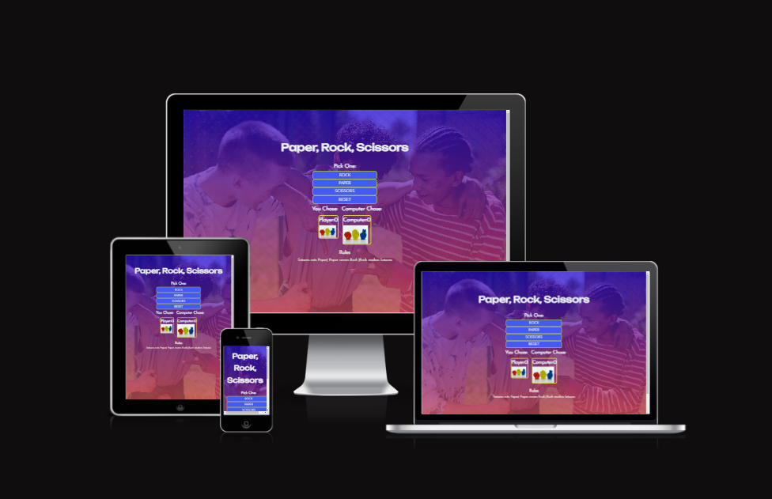
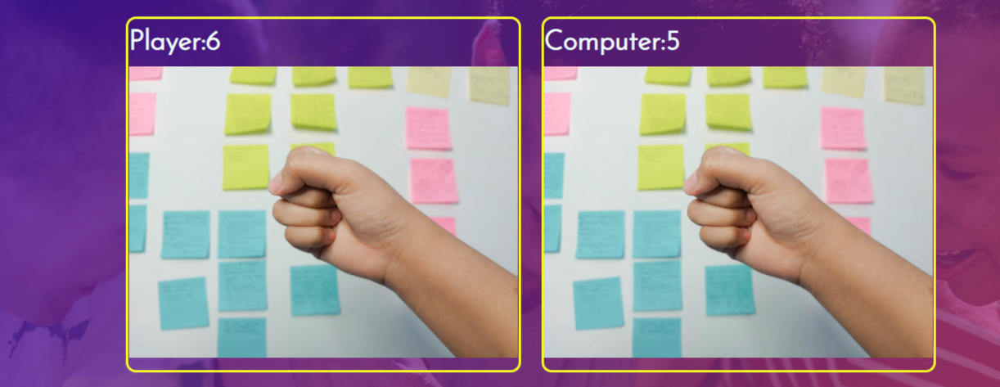
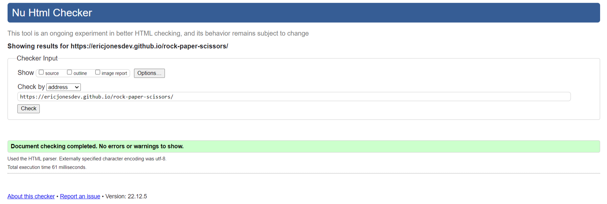
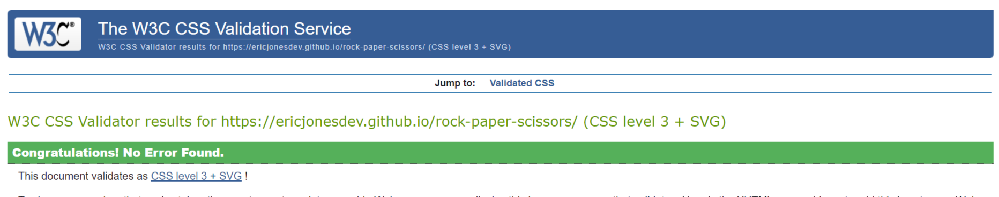
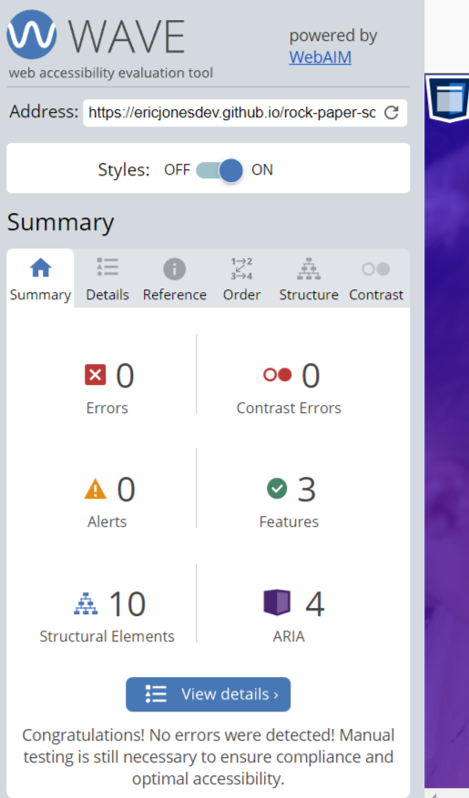
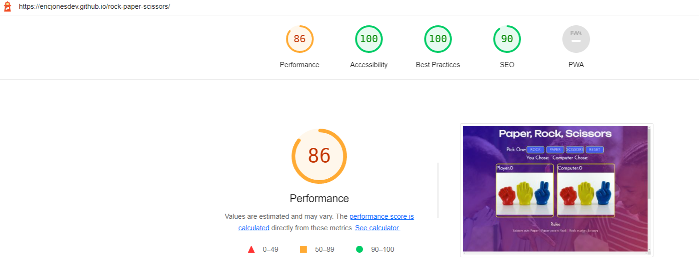

# Benjamin Banneker

<a href="https://ericjonesdev.github.io/rock-paper-scissors/">Visit the live webpage</a>

# 1. Project Overview

Paper, Rock, and Scissor is an interactive web app centered on allowing the user to pass the time playing a fun game. The look, feel, and functionality will be explained in the following sections:

## 1.1 Project Objective

The project objective was to create an interactive and visually appealing web app, catering to those who enjoy video games, as well as games of chance.

## 1.2 User Stories

### First time users

- As a first time user I want an excellent visual experience
- As a first time user I want to quickly understand what the site is about.
- As a first time user I want to easily interact with website content.
- As a first time user I want to understand how the game is played.
- As a first time user I want to easily distingish this site as a trusted site which is safe to use.

### Returning users

- As a returning user I would like to see regular game updates.
- As a returning user I would like to have a history of my gaming score.

### Site Owner

- As a site owner I want to provide a fun and interactive gaming experience.
- As a site owner I want to have my site visually stand out.

## 1.3 Design

To serve as a gaming website, a simplistic but functional design was needed. This combination served two primary purposes. The first purpose, simplicity, was used to maintaine a pleasant look and asthetic to cater to younger users, while having content structures that would appeal to users of varying age groups.

Where applicable, accessibility and useability regarding color schematics, semantic markup, and overall structure where adhered to.

A root CSS statement was used to place color-contrasting colors on the body background.
Using further CSS statements:

A pleasantly-colored and visually appealing background is serviced to the end-user.

This site uses the 60&, 30%, and 10% rule, in reference to site color, meaning 60% of the site color is the linear gradient, 30% is the yellow & neon highlights, and 10% is the white text color.

To accomodate for the variying viewport types, media queries were employed for overall responsiveness across platforms.

# 2. Features

The website is a single stand-alone page which gives the user the ability to play the well-known Paper, Rock, and Scissors game.

## 2.1 Header Area

The website was organized into four main sections, those being the header, choices area, main game section, and the footer.

The header section was used to notify the end-user exactly what game this website features.

## 2.2 Game Choices Area

The game choices area gives the user the opportunity to choose between paper, rock, scissors, and to reset the game if desired.

As the game progresses, to the right of the reset button there is an area that dynamically tells the user who won the current game.

## 2.3 Score Count & Images Area

The game score section has the following functionalies: 

  1. Upon the user making a choice, the image changes to reflect this choice.
  2. The game winer score count tally is incremented by 1 for every successful game won. A draw will result in no incrementation of user or computer score.

## Footer Section

The footer section contains the game rules with which the user can use to play the game. The information is centered and right below the score and images area.

## 2.6 Features to Implement

When there is time, I would like to add a player high score area, so that returning users are able to see their placement within all users who may have played the game on this website.

# 3. Testing

## 3.1 HTML Validation

All documents were validated using the free W3C Markup validation service. A majority of initial errors received pertained to the H2 statements having missing closing statements due to re-editing certain lines of code.

Chrome development tools, as well as Firefox development tools where used to view each page and page behavior for functionality.

### Home Page

## 3.2 CSS Validation

To validate the site CSS, the site CSS file was uploaded to the W3C Jigsaw validation service. The first attempt indicated a CSS rule regarding max-width that had to be altered to return back an error free test result.

## Acessibility Validation Service

The Wave web accessibility evaluation tool was used to ensure that the site passed the industry-standard accessibility criteria. The results indicated no errors and good site structure.

## 3.4 Lighthouse

The Lighthouse performance app was used to test the website performance.

## 3.5 Manual Testing User Stories

|       User Story                                                                                             |                       Testing                                                                                                                             |
| -------------------------------------------------------------------------------------------------- | -------------------------------------------------------------------------------------------------------------------------------------------------- |
| As a first time user I want an excellent visual experience                                         | The home page will illustrate to the user that thought and care was taken in the design.                                                 |
| As a first time user I want to quickly understand what the site is about.                          | The Header as well as footer illustrates this to the user.                                                                  |
| As a first time user I want to also be able to keep a tally of my score for return visits.                            | Slotted for a future build.                                            |
| As a first time user I want the ability to easily navigate the site.                               | The site is a stand-alone web page.                                                        |
| As a first time user I want to easily distingish this site as a trusted site which is safe to use. | Code validation ensures that the site is safe to use.                                                  |
| As a site owner I want to provide pleasant gaming experience.                                | Providing an easy to use layout with clearn markup will allow the user a seamless gaming experience.                                               |
| As a site owner I want to enable a score tracker to display highest score.                                  | Feature slotted for a future build. |
| As a site owner I want to ensure a visually appealing site.                                   | The website styles and design were crafted with great care and attention to detail.                                                              |

## 3.6 Bugs and Fixes

Some bugs that were discovered and corrected throughout the development:
 | Bug                                                                                                                  | Fix                                                                                                |
 | ------------------------------------------------------------------------------------------------------------------------- | -------------------------------------------------------------------------------------------------------- |
 | The user/computer score count originally was not incrementing      | This was caused by the reset button being called by the choice button event listeners and being included within the choices button function. I changed the choice button variables to call the class and did an Array.for loop to successfully seperate the logic between the two. |
 | The images were not originally changing according to the user/computer choices. | Template literal statements were adjusted to correct this error |
 | UserZ/computer game score not always incrementing   |  Currently being investigated.                                                                                                        |

# 4. Deployment

This website was developed using an online version of VS code, via the gitpod/github applications and repositories. The following steps were taken:

    1. Navigate to the Benjamin Banneker githup repository
    2. Select the settings tab
    3. Select Pages within the left navigation payne
    4. Select the deploy from branch (main branch) under source
    5. Upon succesful completion of the app and refresh of page the link is displayed

   You may view the Github repository by clicking <a href="https://github.com/ericjonesdev/rock-paper-scissors">here</a>.

# 5. Credits

## 5.1 Images Used

   The following URLs are the sources of images:

https://unsplash.com/@imanitor?utm_source=unsplash&utm_medium=referral&utm_content=creditCopyText

three friends by cottonbro studio: https://www.pexels.com/photo/friends-playing-together-10506091/

https://www.freeimages.com/download/rock-paper-scissors-1238146
